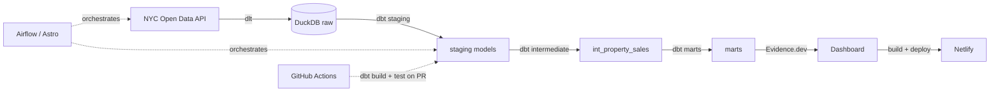

# NYC Property Market Pipeline

A production-style data pipeline and analytics dashboard answering: **how has price per square foot changed across NYC boroughs and property types over the trailing years, and which neighborhoods are materially outperforming or lagging their borough?**

**Live dashboard:** https://zippy-halva-90a699.netlify.app

Built on real government data at real scale: NYC Department of Finance Rolling Sales transactions joined against NYC PLUTO parcel records, ~210,000 analyzed transactions.

## Architecture

**Stack:** dlt (extraction), DuckDB (warehouse), dbt-core (transform), Airflow via Astro CLI/Docker (orchestration), Evidence.dev (BI), Netlify (hosting), GitHub Actions (CI)

## How to run it

**Prerequisites:** Python 3.11+, Node.js (x64 build specifically, see note below), Docker Desktop, Astro CLI

**1. Ingestion**

python -m venv venv

venv\Scripts\activate

pip install -r requirements.txt

python include/dlt_pipeline/pipeline.py

First run pulls full history (about 1.2 million rows combined, 30 to 60+ minutes). Set DEV=1 as an environment variable for a fast sample during development.

**2. Transform**

cd include/dbt_project

dbt run --profiles-dir ~/.dbt

dbt test --profiles-dir ~/.dbt

Requires a profiles.yml in your user folder's .dbt directory, pointing the path setting at ../nyc_property.duckdb.

**3. Orchestration**

astro dev start

Opens the Airflow UI at localhost:8080 (default login admin/admin). The nyc_property_pipeline DAG runs ingestion, then dbt run, then dbt test, on a weekly schedule.

**4. Dashboard**

cd dashboard

npm install --legacy-peer-deps

Copy-Item ..\include\nyc_property.duckdb sources\nyc_property\nyc_property.duckdb -Force

npm run sources

npm run dev

Opens at localhost:3000. Note: the dashboard reads a snapshot copy of the database, not a live connection, so rerun the copy step after any pipeline refresh.

**Windows ARM64 note:** DuckDB's native Node binding has no ARM64 Windows build. If npm run sources fails with an architecture error, install the x64 build of Node with winget install OpenJS.NodeJS.LTS --architecture x64. It runs fine under Windows' built-in x64 emulation.

## Data quality and methodology

Full detail is in the dashboard's own Methodology section, which reads live from mart_data_quality so the numbers stay current rather than being hardcoded here. In summary: staging layers do no filtering, only type casting. Every business exclusion (zero or negative price, missing square footage, unmatched parcels, condo or co-op unit sales, statistical outliers) is flagged and counted in int_property_sales, not silently dropped. Median is used as the primary dollar-per-square-foot metric throughout, since transaction-level dollar-per-square-foot is heavily right-skewed.

## One honest tradeoff

Condo and co-op unit sales are excluded from all dollar-per-square-foot calculations. NYC PLUTO's building area field describes an entire building, not an individual unit, so dividing one apartment's sale price by its whole building's square footage produces a number with no real meaning, not just noisy data. This was discovered by inspecting the actual distribution rather than assumed: median dollar-per-square-foot for unit sales came out to $6.58, against $465.58 for all other sales, across roughly 210,000 transactions. Rather than quietly accept a distorted citywide number, these roughly 112,000 transactions, over half the dataset, are excluded specifically from dollar-per-square-foot math, while still counting fully toward transaction counts and sale volume. The real fix would require a separate per-unit square footage source, such as the NYC Department of Buildings' condo unit records, which this project does not yet ingest.

Two smaller tradeoffs, also deliberate rather than accidental: the dashboard reads a manually refreshed snapshot of the warehouse rather than a live connection, which is simpler to build but goes stale between refreshes. And CI pulls a live sample from NYC's public API on every pull request rather than using a committed fixture dataset, so a CI failure could occasionally reflect NYC's API being down rather than a real code problem.

## Project structure

dags/ holds Airflow DAG definitions.

include/dlt_pipeline/ holds extraction code.

include/dbt_project/ holds transform code: staging, then intermediate, then marts.

dashboard/ holds the Evidence.dev BI project.

.github/workflows/ holds the CI workflow that runs dbt build and test on every PR.

.github/ci-profiles/ holds the dbt connection config used specifically by CI.